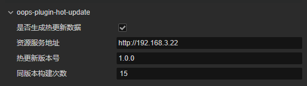

热更新流程,有bug还没解决
1.热更新流程，插件已装好，只需要在构建的时候
选择需要热更，填好地址版本号生成，点击构建
2.构建完成后在remote下能看到生成的内容，把project.manifest，version.manifest复制到assets/resources/目录下再构建一次
3.构建完成后在remote下能看到生成的内容，把内容部署到资源服务地址就可以了

需要nodejs 安装socketio.client
